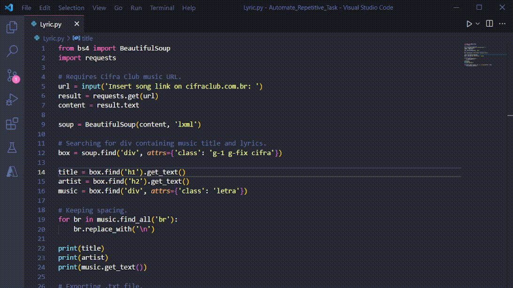

<p align="center">

</p>

## :clipboard: Index

- [Preview](#computer-preview)
- [About](#book-about)
- [Utilized tecnology](#rocket-utilized-tecnology)
- [How to executed](#how-to-executed)

---

## :computer: Preview

<p align="center">
    
</p>

---

## :book: About

This project was created to help me learn more about Web Scraping, for that, I had the help of the Beautiful Soup library.
Beautiful Soup is a Python package for parsing HTML and XML documents.

The focus of the code is to receive a link from [Cifra Club](https://www.cifraclub.com.br/) and return it as a text file with title, artist name and song.

---

## :rocket: Utilized tecnology

This project focuses on the following technologies

- Python
- Beautiful Soup (Python package)
- Requests (Python library)

---

## How to executed

```bash
# Clone the repository
git clone https://github.com/FroelichTech/Lyric-Web-Scraping.git

# Enter directory
cd Lyric-Web-Scraping

# Run the code in a terminal.
py Lyric.py

```
I hope you enjoy.💙

Developed by Eduardo Froelich.:metal:
